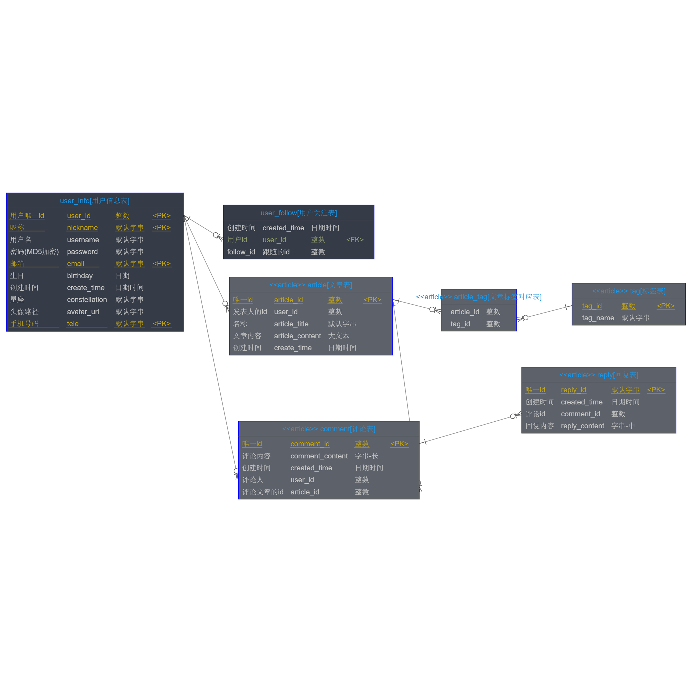
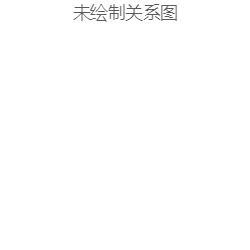

## 
目录

 - ### 1. 模块清单
- [<h4 id="module-user-from">1.1. 用户</h4>](#module-user "user")
	- [<h5 id="module-user-relation}-from">1.1.1. 关联关系</h5>](#module-user-relation "关联关系")
	- [<h5 id="module-user-tableList-from">1.1.2. 表清单</h5>](#module-user-tableList "表清单")
	- [<h5 id="module-user-tableColumnList-from">1.1.3. 表列清单</h5>](#module-user-tableColumnList "表列清单")
		- [<h6 id="module-user-tableColumnList-user_info-from">1.1.3.1 user\_info【用户信息表】</h6>](#module-user-tableColumnList-user_info "user_info")
		- [<h6 id="module-user-tableColumnList-user_follow-from">1.1.3.2 user\_follow【用户关注表】</h6>](#module-user-tableColumnList-user_follow "user_follow")
- [<h4 id="module-article-from">1.2. 文章模块</h4>](#module-article "article")
	- [<h5 id="module-article-relation}-from">1.2.1. 关联关系</h5>](#module-article-relation "关联关系")
	- [<h5 id="module-article-tableList-from">1.2.2. 表清单</h5>](#module-article-tableList "表清单")
	- [<h5 id="module-article-tableColumnList-from">1.2.3. 表列清单</h5>](#module-article-tableColumnList "表列清单")
		- [<h6 id="module-article-tableColumnList-comment-from">1.2.3.1 comment【评论表】</h6>](#module-article-tableColumnList-comment "comment")
		- [<h6 id="module-article-tableColumnList-reply-from">1.2.3.2 reply【回复表】</h6>](#module-article-tableColumnList-reply "reply")
		- [<h6 id="module-article-tableColumnList-tag-from">1.2.3.3 tag【标签表】</h6>](#module-article-tableColumnList-tag "tag")
		- [<h6 id="module-article-tableColumnList-article_tag-from">1.2.3.4 article\_tag【文章标签对应表】</h6>](#module-article-tableColumnList-article_tag "article_tag")
		- [<h6 id="module-article-tableColumnList-article-from">1.2.3.5 article【文章表】</h6>](#module-article-tableColumnList-article "article")
  ---

### 1. 模块清单
 - [<h4 id="module-user">1.1. 用户</h4>](#module-user-from)
 - [<h5 id="module-user-relation">1.1.1 关联关系</h5>](#module-user-relation-from)
 ---

 ---

 - [<h5 id="module-user-tableList">1.1.2 表清单</h5>](#module-user-tableList-from)

 ---

| 名称 | 代码 | 备注 |
| ------------ | ------------ | ------------ |
| 用户信息表 | user\_info |  |
| 用户关注表 | user\_follow |  |

 ---

 - [<h5 id="module-user-tableColumnList">1.1.3 表列清单</h5>](#module-user-tableColumnList-from)

 ---

 - [<h6 id="module-user-tableColumnList-user_info">user_info【用户信息表】</h6>](#module-user-tableColumnList-user_info-from)

| 代码 | 名称 | 数据类型(MYSQL) | 主键 | 备注 |
| ------------ | ------------ | ------------ | ------------ | ------------ |
| user\_id | 用户唯一id | INT | √ | 自增长id |
| nickname | 昵称 | VARCHAR(32) | √ |  |
| username | 用户名 | VARCHAR(32) |  |  |
| password | 密码(MD5加密) | VARCHAR(32) |  |  |
| email | 邮箱 | VARCHAR(32) | √ |  |
| birthday | 生日 | DATE |  |  |
| create\_time | 创建时间 | DATETIME |  |  |
| constellation | 星座 | VARCHAR(32) |  |  |
| avatar\_url | 头像路径 | VARCHAR(32) |  |  |
| tele | 手机号码 | VARCHAR(32) | √ |  |

 ---

 - [<h6 id="module-user-tableColumnList-user_follow">user_follow【用户关注表】</h6>](#module-user-tableColumnList-user_follow-from)

| 代码 | 名称 | 数据类型(MYSQL) | 主键 | 备注 |
| ------------ | ------------ | ------------ | ------------ | ------------ |
| created\_time | 创建时间 | DATETIME |  |  |
| user\_id | 用户id | INT |  |  |
| 跟随的id | follow_id | INT |  |  |

 ---

 - [<h4 id="module-article">1.2. 文章模块</h4>](#module-article-from)
 - [<h5 id="module-article-relation">1.2.1 关联关系</h5>](#module-article-relation-from)
 ---

 ---

 - [<h5 id="module-article-tableList">1.2.2 表清单</h5>](#module-article-tableList-from)

 ---

| 名称 | 代码 | 备注 |
| ------------ | ------------ | ------------ |
| 评论表 | comment |  |
| 回复表 | reply |  |
| 标签表 | tag |  |
| 文章标签对应表 | article\_tag |  |
| 文章表 | article |  |

 ---

 - [<h5 id="module-article-tableColumnList">1.2.3 表列清单</h5>](#module-article-tableColumnList-from)

 ---

 - [<h6 id="module-article-tableColumnList-comment">comment【评论表】</h6>](#module-article-tableColumnList-comment-from)

| 代码 | 名称 | 数据类型(MYSQL) | 主键 | 备注 |
| ------------ | ------------ | ------------ | ------------ | ------------ |
| comment\_id | 唯一id | INT | √ |  |
| comment\_content | 评论内容 | VARCHAR(3072) |  |  |
| created\_time | 创建时间 | DATETIME |  |  |
| user\_id | 评论人 | INT |  |  |
| article\_id | 评论文章的id | INT |  |  |

 ---

 - [<h6 id="module-article-tableColumnList-reply">reply【回复表】</h6>](#module-article-tableColumnList-reply-from)

| 代码 | 名称 | 数据类型(MYSQL) | 主键 | 备注 |
| ------------ | ------------ | ------------ | ------------ | ------------ |
| reply\_id | 唯一id | VARCHAR(32) | √ |  |
| created\_time | 创建时间 | DATETIME |  |  |
| comment\_id | 评论id | INT |  |  |
| reply\_content | 回复内容 | VARCHAR(1024) |  |  |

 ---

 - [<h6 id="module-article-tableColumnList-tag">tag【标签表】</h6>](#module-article-tableColumnList-tag-from)

| 代码 | 名称 | 数据类型(MYSQL) | 主键 | 备注 |
| ------------ | ------------ | ------------ | ------------ | ------------ |
| tag\_id |  | INT | √ |  |
| tag\_name |  | VARCHAR(32) |  |  |

 ---

 - [<h6 id="module-article-tableColumnList-article_tag">article_tag【文章标签对应表】</h6>](#module-article-tableColumnList-article_tag-from)

| 代码 | 名称 | 数据类型(MYSQL) | 主键 | 备注 |
| ------------ | ------------ | ------------ | ------------ | ------------ |
| article\_id |  | INT |  |  |
| tag\_id |  | INT |  |  |

 ---

 - [<h6 id="module-article-tableColumnList-article">article【文章表】</h6>](#module-article-tableColumnList-article-from)

| 代码 | 名称 | 数据类型(MYSQL) | 主键 | 备注 |
| ------------ | ------------ | ------------ | ------------ | ------------ |
| article\_id | 唯一id | INT | √ |  |
| user\_id | 发表人的id | INT |  |  |
| article\_title | 名称 | VARCHAR(32) |  |  |
| article\_content | 文章内容 | TEXT |  |  |
| create\_time | 创建时间 | DATETIME |  |  |

 ---

