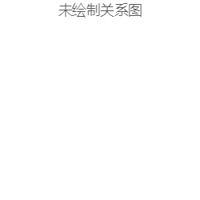

## 
目录

 - ### 1. 模块清单
- [<h4 id="module-user-from">1.1. 用户模块</h4>](#module-user "user")
	- [<h5 id="module-user-relation}-from">1.1.1. 关联关系</h5>](#module-user-relation "关联关系")
	- [<h5 id="module-user-tableList-from">1.1.2. 表清单</h5>](#module-user-tableList "表清单")
	- [<h5 id="module-user-tableColumnList-from">1.1.3. 表列清单</h5>](#module-user-tableColumnList "表列清单")
		- [<h6 id="module-user-tableColumnList-user_info-from">1.1.3.1 user\_info【用户信息表】</h6>](#module-user-tableColumnList-user_info "user_info")
		- [<h6 id="module-user-tableColumnList-event-from">1.1.3.2 event【志愿者活动表】</h6>](#module-user-tableColumnList-event "event")
		- [<h6 id="module-user-tableColumnList-event_tag-from">1.1.3.3 event\_tag【活动标签表】</h6>](#module-user-tableColumnList-event_tag "event_tag")
		- [<h6 id="module-user-tableColumnList-event_apply-from">1.1.3.4 event\_apply【活动申请表】</h6>](#module-user-tableColumnList-event_apply "event_apply")
  ---

### 1. 模块清单
 - [<h4 id="module-user">1.1. 用户模块</h4>](#module-user-from)
 - [<h5 id="module-user-relation">1.1.1 关联关系</h5>](#module-user-relation-from)
 ---

 ---

 - [<h5 id="module-user-tableList">1.1.2 表清单</h5>](#module-user-tableList-from)

 ---

| 名称 | 代码 | 备注 |
| ------------ | ------------ | ------------ |
| 用户信息表 | user\_info |  |
| 志愿者活动表 | event |  |
| 活动标签表 | event\_tag |  |
| 活动申请表 | event\_apply |  |

 ---

 - [<h5 id="module-user-tableColumnList">1.1.3 表列清单</h5>](#module-user-tableColumnList-from)

 ---

 - [<h6 id="module-user-tableColumnList-user_info">user_info【用户信息表】</h6>](#module-user-tableColumnList-user_info-from)

| 代码 | 名称 | 数据类型(MYSQL) | 主键 | 备注 |
| ------------ | ------------ | ------------ | ------------ | ------------ |
| user\_id | 用户id | INT | √ |  |
| user\_class | 班级 | VARCHAR(32) |  |  |
| user\_school | 学院 | VARCHAR(32) |  |  |
| user\_avator | 用户头像 | VARCHAR(32) |  | 头像路径 |
| user\_name | 用户姓名 | VARCHAR(32) |  |  |
| user\_score | 用户积分 | INT |  | 100~0分数，初始100分，低于60份不得发布活动，参加活动 |
| password | 用户密码 | VARCHAR(32) |  | des加密数据(md5不可逆加密算法) |
| stu\_id | 学号 | VARCHAR(32) |  |  |
| create\_time | 创建时间 | DATETIME |  |  |
| role | 用户身份 | INT |  | 0普通用户 1管理员 |

 ---

 - [<h6 id="module-user-tableColumnList-event">event【志愿者活动表】</h6>](#module-user-tableColumnList-event-from)

| 代码 | 名称 | 数据类型(MYSQL) | 主键 | 备注 |
| ------------ | ------------ | ------------ | ------------ | ------------ |
| event\_id | 活动id | INT | √ |  |
| event\_img\_url | 活动的图片链接 | VARCHAR(32) |  |  |
| start\_time | 活动开始时间 | DATETIME |  |  |
| title | 活动标题 | VARCHAR(32) |  |  |
| location | 活动地点 | VARCHAR(32) |  |  |
| user\_id | 发起人 | VARCHAR(32) |  |  |
| description | 活动介绍 | VARCHAR(1024) |  |  |
| end\_time | 活动结束时间 | DATETIME |  |  |
| event\_score | 积分 | VARCHAR(32) |  |  |
| supply\_name | 举办方 | VARCHAR(32) |  |  |
| status | 活动进行状态 | VARCHAR(32) |  | 报名中/进行中/已结束 |
| maxnum | 上限人数 | INT |  |  |

 ---

 - [<h6 id="module-user-tableColumnList-event_tag">event_tag【活动标签表】</h6>](#module-user-tableColumnList-event_tag-from)

| 代码 | 名称 | 数据类型(MYSQL) | 主键 | 备注 |
| ------------ | ------------ | ------------ | ------------ | ------------ |
| et\_id | 自增长用户标签名 | INT | √ |  |
| tag\_name | 标签名 | VARCHAR(32) |  |  |

 ---

 - [<h6 id="module-user-tableColumnList-event_apply">event_apply【活动申请表】</h6>](#module-user-tableColumnList-event_apply-from)

| 代码 | 名称 | 数据类型(MYSQL) | 主键 | 备注 |
| ------------ | ------------ | ------------ | ------------ | ------------ |
| event\_apply\_id | 自增长id | INT | √ |  |
| user\_id | 申请人的id | INT |  |  |
| event\_id | 活动的id | INT |  |  |
| apply\_status | 申请状态 | VARCHAR(32) |  | 报名中/报名通过/已签到/已完成/未签到 |
| created\_time | 创建时间 | DATETIME |  |  |

 ---

